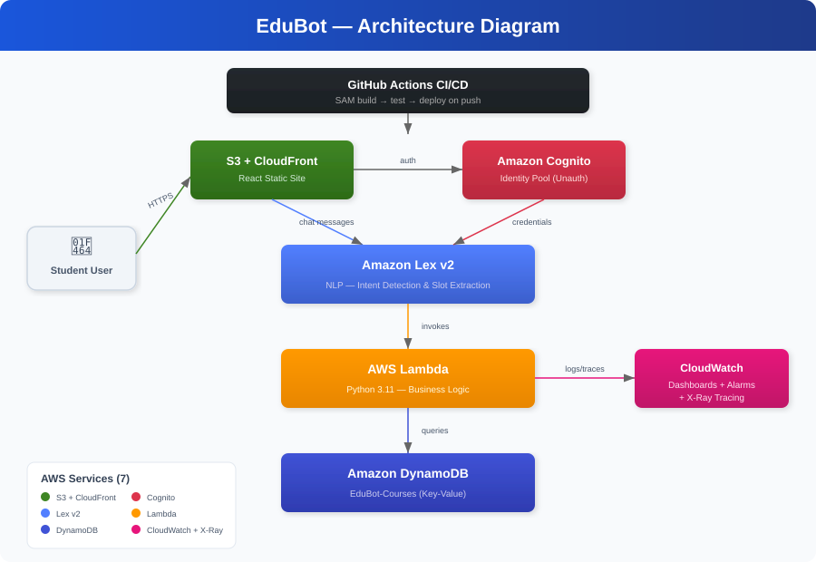

# EduBot — AWS Serverless Student Assistant Chatbot

EduBot is a cloud-native, fully serverless chatbot that helps students query academic information including course syllabi, class schedules, professor details, and assignment deadlines.

## Architecture



<details>
<summary>Text-based diagram</summary>

```
┌──────────────┐    ┌──────────────┐    ┌──────────────────┐
│  S3 + CF     │    │ Amazon       │    │ CloudWatch       │
│  Static Site │    │ Cognito      │    │ Dashboards +     │
│  (React UI)  │──▶│ Identity Pool│    │ X-Ray Tracing    │
└──────┬───────┘    └──────┬───────┘    └──────────────────┘
       │                   │                      ▲
       │ chat messages     │ auth                  │ logs/metrics
       ▼                   ▼                      │
┌──────────────────────────────────┐              │
│         Amazon Lex v2            │              │
│    (NLP — intent detection)      │              │
└──────────────┬───────────────────┘              │
               │ invokes                          │
               ▼                                  │
┌──────────────────────────────────┐              │
│         AWS Lambda               │──────────────┘
│    (Python 3.11 — business logic)│
└──────────────┬───────────────────┘
               │ queries
               ▼
┌──────────────────────────────────┐
│       Amazon DynamoDB            │
│    (Courses table — key-value)   │
└──────────────────────────────────┘
```
</details>

## AWS Services Used

| Service | Purpose |
|---------|---------|
| **S3 + CloudFront** | Hosts the React frontend as a static website |
| **Amazon Cognito** | Provides unauthenticated identity pool so the browser can call Lex directly |
| **Amazon Lex v2** | NLP engine — detects user intent and extracts slots (e.g., course ID) |
| **AWS Lambda** | Serverless backend that queries DynamoDB and returns formatted responses |
| **Amazon DynamoDB** | NoSQL database storing course data (syllabi, schedules, professors) |
| **CloudWatch** | Logging, metrics dashboards, and alarms for monitoring |
| **X-Ray** | Distributed tracing across Lambda and DynamoDB calls |

## Prerequisites

- AWS account with appropriate permissions
- [AWS CLI](https://aws.amazon.com/cli/) configured with credentials
- [AWS SAM CLI](https://docs.aws.amazon.com/serverless-application-model/latest/developerguide/install-sam-cli.html)
- [Node.js 20+](https://nodejs.org/)
- [Python 3.11+](https://www.python.org/)
- GitHub account (for CI/CD)

## Project Structure

```
├── template.yaml                # SAM template (all infrastructure)
├── samconfig.toml               # SAM deployment config
├── backend/lambda/
│   ├── handler.py               # Lambda function (5 intents)
│   ├── requirements.txt         # Python dependencies
│   └── seed_data.py             # DynamoDB seed script
├── frontend/src/
│   ├── App.js                   # Main React component
│   ├── components/              # ChatWindow, ChatInput, MessageBubble
│   └── services/lexClient.js    # AWS SDK Lex client
├── tests/test_handler.py        # Unit tests
├── monitoring/dashboard.json    # CloudWatch dashboard
└── .github/workflows/deploy.yml # CI/CD pipeline
```

## Deployment

### 1. Deploy Backend (First Time)

```bash
sam build
sam deploy --guided
```

Follow the prompts. Note the outputs: `IdentityPoolId`, `FrontendURL`, `CoursesTableName`.

### 2. Create Lex Bot (Manual — One Time)

The Lex v2 bot is created manually via the AWS Console because CloudFormation support for Lex v2 is incomplete. This is standard practice.

1. Go to **Amazon Lex v2** in the AWS Console
2. Create a new bot named **EduBot**
3. Add intents: `GetCourseSyllabus`, `GetProfessorInfo`, `GetClassSchedule`, `GetAssignmentDeadline`
4. Each intent needs a `CourseId` slot (type: `AMAZON.AlphaNumeric`)
5. Add sample utterances for each intent
6. Set the fulfillment Lambda to `EduBotHandler`
7. Build and publish the bot
8. Note the **Bot ID** and **Bot Alias ID**

### 3. Seed the Database

```bash
cd backend/lambda
python seed_data.py
```

### 4. Configure Frontend

```bash
cd frontend
cp .env.example .env
```

Edit `.env` with your actual values:
```
REACT_APP_AWS_REGION=us-east-1
REACT_APP_IDENTITY_POOL_ID=<from SAM output>
REACT_APP_LEX_BOT_ID=<from Lex console>
REACT_APP_LEX_BOT_ALIAS_ID=<from Lex console>
```

### 5. Deploy Frontend

```bash
cd frontend
npm install
npm run build
aws s3 sync build/ s3://edubot-frontend-<account-id>/ --delete
```

### 6. CI/CD (Subsequent Deploys)

Add these GitHub secrets:
- `AWS_ACCESS_KEY_ID`
- `AWS_SECRET_ACCESS_KEY`
- `AWS_ACCOUNT_ID`
- `IDENTITY_POOL_ID`
- `LEX_BOT_ID`
- `LEX_BOT_ALIAS_ID`

Every push to `main` triggers the pipeline: test → SAM deploy → frontend build → S3 sync.

## Local Development

```bash
# Start React dev server
cd frontend && npm start

# Run unit tests
python -m pytest tests/ -v

# Test Lambda locally
sam local invoke EduBotFunction
```

## Monitoring

Deploy the CloudWatch dashboard:

```bash
aws cloudwatch put-dashboard \
  --dashboard-name EduBot-Dashboard \
  --dashboard-body file://monitoring/dashboard.json
```

The dashboard includes:
- Lambda invocation count and error rate
- Lambda duration percentiles (p50/p90/p99)
- DynamoDB consumed read capacity
- Lex missed utterances and latency
- Lambda concurrent executions

## Screenshots

| Chat Interface | Syllabus Query | Professor Info |
|:-:|:-:|:-:|
|  |  |  |

| AWS Lex Console | CloudWatch Dashboard | DynamoDB Table |
|:-:|:-:|:-:|
|  |  |  |

> **Note:** Add your own screenshots to `docs/screenshots/` to replace the placeholders above.

## Using the Chatbot

Once deployed, visit the S3 website URL (from SAM outputs). Try these queries:

- "What is the syllabus for CS101?"
- "Who teaches MATH201?"
- "When does PHYS150 meet?"
- "What are the assignment deadlines for BIO101?"

## Cost Analysis

All services used fall within the **AWS Free Tier** for typical academic usage:

| Service | Free Tier Allowance |
|---------|-------------------|
| Lambda | 1M requests/month, 400K GB-seconds |
| DynamoDB | 25 GB storage, 25 RCU/WCU |
| S3 | 5 GB storage, 20K GET requests |
| Cognito | 50K MAU |
| Lex | 10K text requests/month (first year) |
| CloudWatch | 10 custom metrics, 5 GB log ingestion |
| X-Ray | 100K traces/month |

Estimated monthly cost for a university class project: **$0.00** (within free tier).

## Future Enhancements

- Add authentication with Cognito User Pools for personalized responses
- Integrate with a university LMS (Canvas, Blackboard) for real-time data
- Add voice support using Lex voice capabilities
- Implement conversation history and analytics
- Add more intents (GPA calculator, campus maps, event calendar)
- Deploy CloudFront distribution for HTTPS and caching
